\newpage

# Opis projektu

BazarAGH.pl to projekt platformy ogłoszeniowej, której głównym celem jest ułatwienie użytkownikom dokonywania transakcji handlowych, sprzedaży i zakupów różnorodnych produktów oraz usług. Platforma została stworzona specjalnie dla społeczności Miasteczka Studenckiego AGH w Krakowie, jednak jest otwarta dla wszystkich zainteresowanych.

Jednym z głównych atutów BazarAGH.pl jest jego prostota i intuicyjność. Interfejs platformy został zaprojektowany w taki sposób, aby użytkownicy mogli łatwo dodawać ogłoszenia i przeglądać oferty. Aby korzystać z platformy, wystarczy założyć darmowe konto, które umożliwia publikację ogłoszeń.

Projekt platformy ogłoszeniowej BazarAGH.pl stanowi implementację dokumentacji tworzonej w ramach przedmiotu Metody Wytwarzania Oprogramowania [@Hulek_Lisowicz_Turek_Woźniak]. W trakcie tego kursu, studenci mieli okazję zapoznać się z różnorodnymi technikami zarządzania projektem oraz metodologiami wytwarzania oprogramowania. BazarAGH.pl wykorzystuje w praktyce wiele z tych nauczanych technik, co pozwoliło na stworzenie platformy, która jest nie tylko funkcjonalna i intuicyjna, ale także oparta na solidnych podstawach związanych z jakością oprogramowania i efektywnym zarządzaniem projektem. Dzięki temu, platforma BazarAGH.pl stała się praktycznym przykładem zastosowania teoretycznych założeń na temat projektowania i wytwarzania oprogramowania w rzeczywistym środowisku.

# Organizacja pracy w grupie

W trakcie prac nad projektem platformy ogłoszeniowej BazarAGH.pl, wykorzystaliśmy platformę Github jako narzędzie do kontroli wersji i współpracy nad kodem źródłowym. Rozdzielaliśmy zadania korzystając ze zgłoszeń (issues), a każde z nich było przypisane do konkretnego kamienia milowego.

## Podział obowiązków

- Paulina Gacek - szablony podstron, struktura interfejsu graficznego i stylowanie
- Jakub Hulek - widoki aplikacji i logika biznesowa
- Kamila Skorupka - panel administratora, zarządzanie bazą danych
- Piotr Sokołowski - prototypowanie, logika biznesowa, panel administratora

# Postępy prac

Podczas tworzenia projektu wyznaczyliśmy sobie trzy kamienie milowe, które mieliśmy zrealizować w zadanym terminie. Każdy kamień milowy był kończony [tagiem](https://github.com/bazaragh/bazaragh/tags) i [wydaniem](https://github.com/bazaragh/bazaragh/releases) (release) w Githubie, by pokazać postępy.

## Prototyp

Pierwszym krokiem było stworzenie takiego szablonu aplikacji, który będzie pozwalał na wygodną pracę w kilka osób. Struktura plików w projekcie Flask nie jest odgórnie narzucona, w związku z czym to na programiście spoczywa obowiązek jej zaplanowania.

Większość przykładów podawanych w dokumentacji Flaska to projekty, które składają się z jednego skryptu w Python i kilku szablonów Jinja, co w naszym wypadku spowodowałoby ogromny bałagan. W związku z tym zdecydowaliśmy się na skorzystanie z *Application Factory*, czyli Flaskowego sposobu na tworzenie większych aplikacji. Taka aplikacja jest od razu przygotowana do uruchomienia przez WSGI (Web Server Gateway Interface), a przede wszystkim łatwo jest ją rozbudować o kolejne moduły.

Przygotowany szablon został wzbogacony o zapisywanie szczegółowych logów, ponieważ domyślne logi nie pozwalały na jednoznaczne stwierdzenie przyczyny wyrzucenia wyjątku przez aplikację. Finalnie osiągnął on następującą strukturę:

```
BazarAGH
|-- app/
|   |-- engine/         # skrypty pomocnicze rdzenia aplikacji
|   |-- forms/          # formularze
|   |-- logs/           # logi aplikacji
|   |-- static/         # pliki statyczne (CSS, JS, obrazki)
|   |-- templates/      # szablony Jinja
|   |-- utils/          # skrypty pomocnicze
|   |-- views/          # definicje widoków
|   |-- admin.py        # główny skrypt panelu administracyjnego
|   |-- app.py          # główny skrypt aplikacji
|   |-- config.py       # domyślna konfiguracja
|   `-- models.py       # modele ORM
|-- config.local.py     # lokalna konfiguracja, niewersjonowana
`-- wsgi.py
```

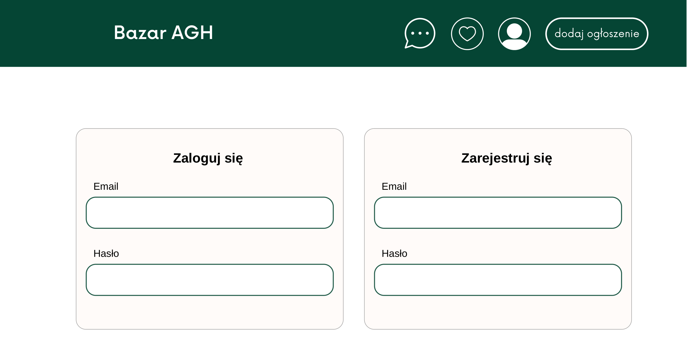

Równolegle do przygotowywania szablonu aplikacji, trwały prace nad bazą danych i konfiguracją serwera. W ramach Github Actions stworzyliśmy integrację, która pozwalała na automatyczne wczytanie na serwer najnowszych zmian. Pozwoliło nam to na testowanie działania aplikacji na środowisku zbliżonym do produkcyjnego. Wszyscy też korzystaliśmy ze wspólnej bazy danych, dzięki czemu mogliśmy porównać między sobą działanie aplikacji.

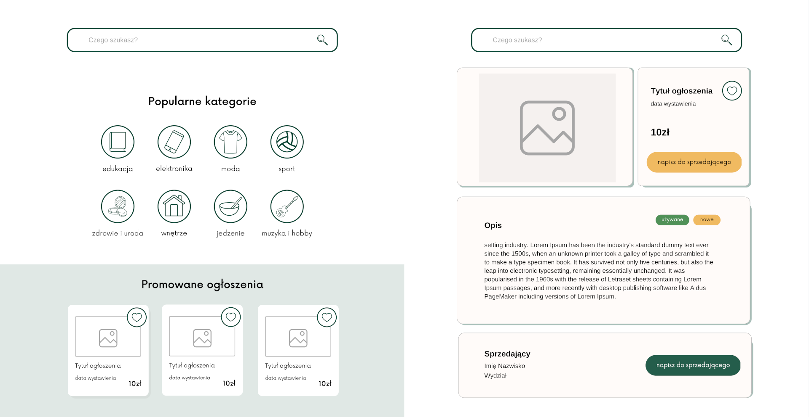

Kod źródłowy - [Github](https://github.com/bazaragh/bazaragh/releases/tag/prototyp)

\newpage

## Złożona implementacja

Kolejnym krokiem milowym w projekcie było wprowadzenie szeregu istotnych funkcjonalności, które znacząco zwiększyły użyteczność i atrakcyjność platformy dla użytkowników. Skoncentrowaliśmy się na rozwinięciu funkcjonalności stworzonych w poprzednim etapie i dodaniu wszystkich wymienionych w dokumentacji.

Istotnym aspektem było ukończenie bazy danych, dodanie wszystkich niezbędnych pól oraz odpowiednich relacji. Dzięki temu użytkownicy mogą teraz wprowadzać pełne informacje dotyczące oferowanych produktów lub usług, co pozwala innym użytkownikom dokładniej zrozumieć ofertę.

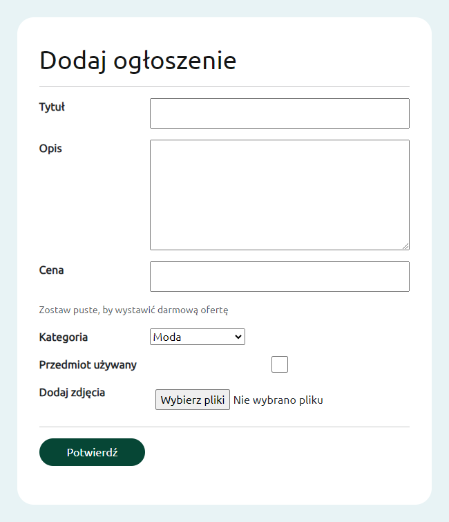

Dodawanie i edycja ogłoszeń stało się prostsze i bardziej intuicyjne dzięki wprowadzeniu przejrzystego interfejsu (rys. \ref{dodaj-ogloszenie}). Umożliwiliśmy użytkownikom dodawanie wielu zdjęć i zarządzanie nimi. Użytkownicy mogą teraz swobodnie dodawać nowe ogłoszenia, a także edytować istniejące (rys. \ref{moje-ogloszenia}), aktualizując informacje lub usuwając ogłoszenie po zakończonej transakcji.

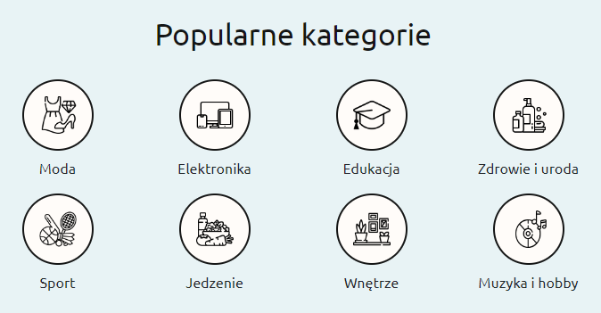

\newpage

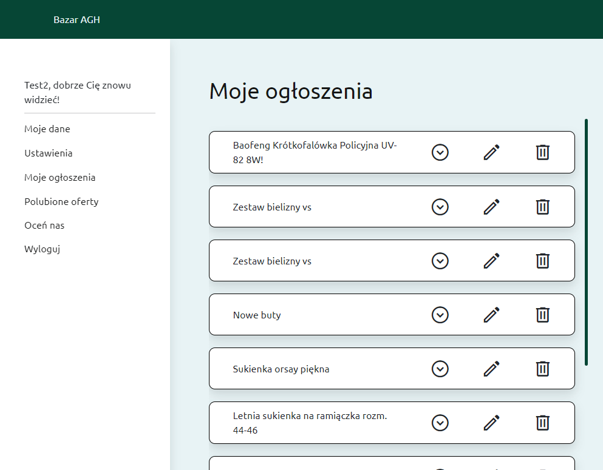

Aby ułatwić nawigację i wyszukiwanie, wprowadziliśmy widok kategorii, który umożliwia użytkownikom szybkie filtrowanie ogłoszeń według interesujących ich kategorii. To znacznie skraca czas poszukiwań i ułatwia znalezienie odpowiednich produktów.


Jedną z kluczowych funkcji, które wprowadziliśmy, jest chat pomiędzy użytkownikami (rys. \ref{menu-chat} i \ref{chat}). Dzięki temu użytkownicy mogą komunikować się w prosty sposób, negocjować warunki transakcji, zadawać pytania i zawierać umowy. To znacznie ułatwia proces sprzedaży i zakupu na platformie.

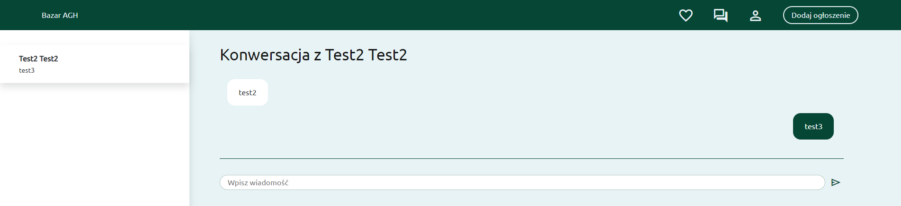

W celu utrzymania użytkowników w stałej informacji, wprowadziliśmy również system powiadomień email (rys. \ref{mail}). Użytkownicy otrzymują teraz powiadomienia na swoje skrzynki pocztowe dotyczące zmian w ich profilu oraz innych istotnych informacji, co umożliwia im szybką reakcję i aktualizację swoich działań.

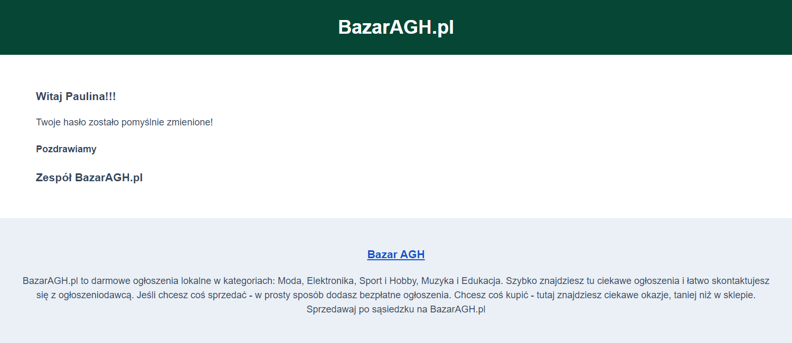

Aby zapewnić użytkownikom możliwość wyrażenia swojej opinii i oceny, umożliwiliśmy przesyłanie opinii o aplikacji (rys. \ref{opinia}) oraz ocenianie zarówno produktów, jak i sprzedawców (rys. \ref{ocena}). To pomaga innym użytkownikom podejmować lepiej poinformowane decyzje dotyczące transakcji.

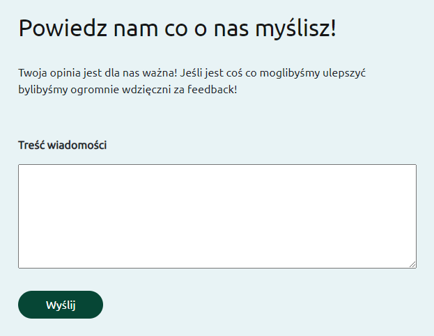

\newpage

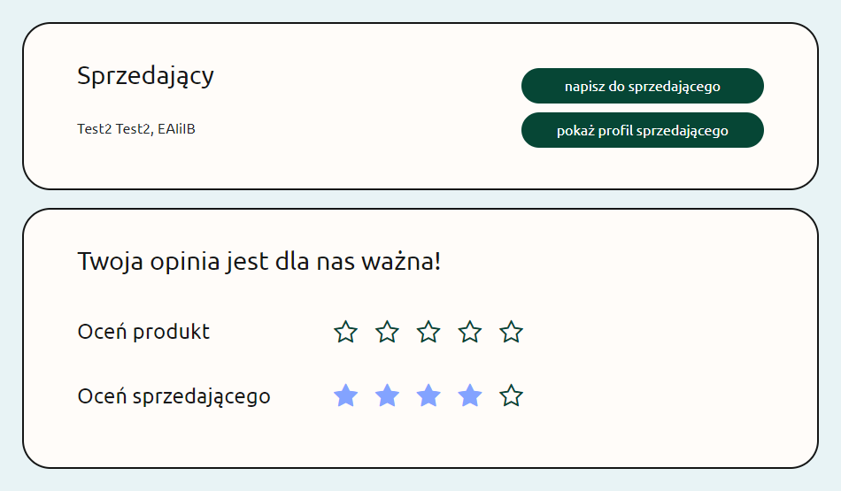

Wprowadziliśmy również funkcjonalność dodawania ofert do ulubionych (rys. \ref{polubione}), która umożliwia użytkownikom śledzenie i zapisywanie interesujących ich ogłoszeń dla późniejszego powrotu do nich.

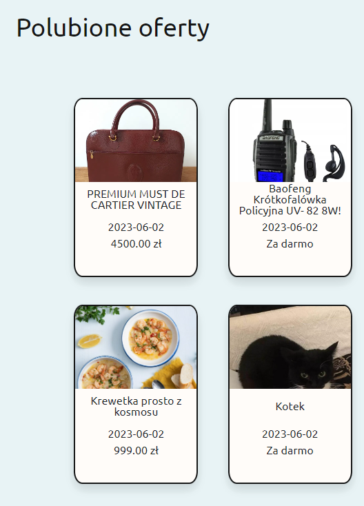

W celu personalizacji profili użytkowników, umożliwiliśmy dodawanie zdjęcia profilowego oraz zarządzanie profilem (rys. \ref{ustawienia}). Użytkownicy mogą teraz wybrać swoje zdjęcie i dostosować informacje na swoim profilu, co dodaje elementu indywidualizacji. Dodaliśmy również możliwość oglądania profili innych użytkowników i przeglądania ich ogłoszeń.

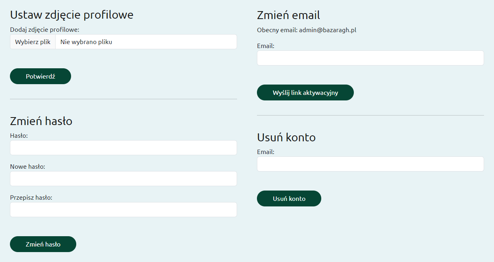

\newpage    

Dodatkowo dodaliśmy:

- powiadomienia, które powiadamiają użytkownika o statusie akcji którą zlecił
- widok kategorii wraz z paginacją zwiększające komfort wyszukiwania ogłoszeń
- resetowanie hasła i weryfikacja e-mail w celu zwiększenia bezpieczeństwa i wygody użytkowników

Kod źródłowy - [Github](https://github.com/bazaragh/bazaragh/releases/tag/zlozona-implementacja)

## Testowanie

Aplikacja została starannie przetestowana przy użyciu zarówno testów jednostkowych, jak i funkcjonalnych, z wykorzystaniem frameworków `pytest` oraz `mocker`. Testy jednostkowe skupiają się na testowaniu poszczególnych komponentów i funkcji aplikacji, weryfikując ich poprawność działania w izolacji. Natomiast testy funkcjonalne mają na celu sprawdzenie, czy aplikacja działa poprawnie jako całość, uwzględniając interakcje między różnymi modułami i scenariuszami użytkowania. W ramach testów jednostkowych, `pytest.fixture` pozwolił na łatwe tworzenie przygotowań i sprzątania dla poszczególnych testów. Dzięki temu możliwe było precyzyjne kontrolowanie kontekstu testów i unikanie niepożądanych efektów ubocznych. Dodatkowo, wykorzystanie klienta aplikacji w zakresie sesji (`scope=session`) umożliwiło utworzenie jednej instancji klienta, która była współdzielona między wszystkimi testami. To zapewniło spójność stanu klienta podczas wykonywania różnych testów, jednocześnie eliminując potrzebę powielania kodu inicjalizującego klienta w każdym teście.

Aby zapewnić segregację między bazą danych produkcyjną a testową, podjęliśmy środki ostrożności i utworzyliśmy oddzielną bazę danych dedykowaną dla testów. Dzięki temu rozwiązaniu unikamy wpływu testów na naszą bazę produkcyjną oraz minimalizujemy ryzyko utraty lub uszkodzenia istotnych danych. Testowa baza danych jest specjalnie skonfigurowana w taki sposób, że odświeża się po zakończeniu każdego testu, przywracając dane do stanu początkowego. Dzięki temu każdy test wykonuje się na tych samych zestawach danych, co zapewnia powtarzalność i spójność wyników. Dzięki rozdzieleniu bazy produkcyjnej od testowej możemy mieć pewność, że testy nie będą miały wpływu na dane produkcyjne i zminimalizujemy ryzyko wprowadzenia niepożądanych zmian lub uszkodzenia danych w naszym środowisku produkcyjnym. Warto zaznaczyć, że zarówno testy jednostkowe, jak i funkcjonalne są wykonywane na tym samym serwerze. Z tego powodu, czasami testowa baza danych może napotkać problemy z połączeniem w trakcie intensywnego przeprowadzania testów. Pomimo tego, że staraliśmy się zoptymalizować konfigurację i zasoby serwera, czasami obciążenie spowodowane wykonywaniem wielu testów jednocześnie może wpływać na wydajność testowej bazy danych. W takich sytuacjach mogą wystąpić krótkotrwałe problemy z połączeniem, które mogą prowadzić do niepowodzeń w niektórych testach. Jednak mimo tych sporadycznych trudności, ciągle staraliśmy się zapewnić jak największą niezawodność naszych testów poprzez odpowiednie zarządzanie zasobami serwera oraz dostosowanie konfiguracji testowej bazy danych. Dążyliśmy do minimalizacji wpływu tych problemów na wyniki testów oraz pracowaliśmy nad doskonaleniem naszej infrastruktury testowej, aby zapewnić jak najbardziej spójne i niezawodne środowisko testowe dla naszej aplikacji.

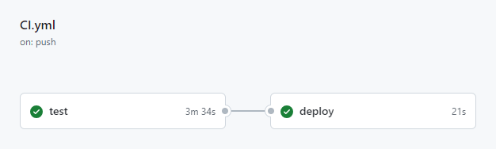

Należy zaznaczyć, że nie przeprowadziliśmy testów wszystkich widoków panelu administratora (flask-admin), ponieważ twórcy frameworku już przetestowali te widoki. Flask-admin jest popularnym narzędziem do zarządzania panelami administratora w aplikacjach opartych na Flask, i został starannie opracowany i przetestowany przez zespół twórców, aby zapewnić stabilność i poprawne funkcjonowanie tych widoków. W naszym przypadku, skoncentrowaliśmy się na testowaniu logiki biznesowej i funkcjonalności specyficznej dla naszej aplikacji, której implementacja nie obejmowała bezpośrednio widoków panelu administratora. Dzięki temu mogliśmy skupić się na testowaniu unikalnych aspektów naszej aplikacji i mieć pewność, że funkcjonalność dostarczana przez flask-admin działa zgodnie z oczekiwaniami. Warto jednak pamiętać, że pomimo tego, że widoki panelu administratora nie były bezpośrednio testowane przez nas, nadal korzystamy z frameworku `pytest` wraz z odpowiednimi narzędziami do mockowania, aby sprawdzić, czy nasze funkcje i komponenty integrują się poprawnie z widokami flask-admin i przekazują oczekiwane dane oraz wykonują właściwe operacje.

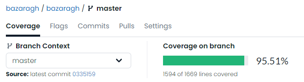

Udało nam się osiągnąć imponujący wskaźnik pokrycia kodu na poziomie 95,5% (rys. \ref{coverage}). Oznacza to, że prawie cały nasz kod został przetestowany, co daje nam wysoki poziom pewności co do jego poprawności i niezawodności. Wspierając nas w tym osiągnięciu, Github Actions odegrało istotną rolę w łatwej integracji testów naszej aplikacji (rys. \ref{github-actions}). Dzięki funkcjonalności automatycznego uruchamiania testów po każdej aktualizacji kodu w repozytorium, Github Actions umożliwiło nam szybkie wykrywanie ewentualnych błędów i problemów zgodności. Dzięki temu narzędziu byliśmy w stanie utrzymać wysoką jakość naszego kodu i szybko reagować na wszelkie potencjalne problemy. Ponadto, dzięki Codecov mieliśmy możliwość szczegółowej analizy przebiegu oraz rozwoju naszych testów (rys. \ref{codecov-files}). Codecov dostarczał nam raporty pokrycia kodu, które pomagały nam zidentyfikować luki w testach oraz obszary wymagające większej uwagi. Dzięki tym raportom mogliśmy podejmować świadome decyzje na temat dalszego rozwoju naszych testów, tak aby nasze testy były jak najbardziej kompleksowe i reprezentatywne dla naszej aplikacji. W rezultacie, wykorzystując Github Actions i Codecov, byliśmy w stanie osiągnąć wysoki poziom pokrycia kodu, co z kolei przyczyniło się do zwiększenia niezawodności i jakości naszej aplikacji.

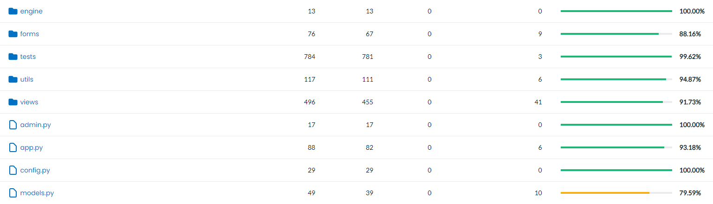

Kod źródłowy - [Github](https://github.com/bazaragh/bazaragh/releases/tag/testowanie)

# Podsumowanie

Stworzony przez nas projekt niestety nie jest dokładnym odzwierciedleniem dokumentacji, na której bazowaliśmy. Różnicą, którą można zauważyć od razu, jest język implementacji - Python zamiast Javy. Żeby zdążyć ze wszystkimi kamieniami milowymi, nasz projekt jest aplikacją webową, a nie mobilną. Ze względu na obowiązujące przepisy, musieliśmy zrezygnować z systemu płatności i stworzyć jedynie platformę będącą tablicą ogłoszeń. Nie byliśmy także w stanie stworzyć systemu wysyłania powiadomień SMS, gdyż wynikało to z ograniczeń sprzętowych naszego serwera.

Postaraliśmy się jednak, by platforma BazarAGH.pl była jak najbardziej zbliżona do pierwowzoru. Baza danych została stworzona zgodnie z diagramem zamieszczonym w dokumentacji, a następnie odchudzona o tabelę z informacjami dotyczącymi zamówienia i płatności. Aplikacja webowa zawiera zintegrowany czat, a dodatkowo użytkownik otrzymuje powiadomienia na swoją skrzynkę mailową.

# Bibliografia